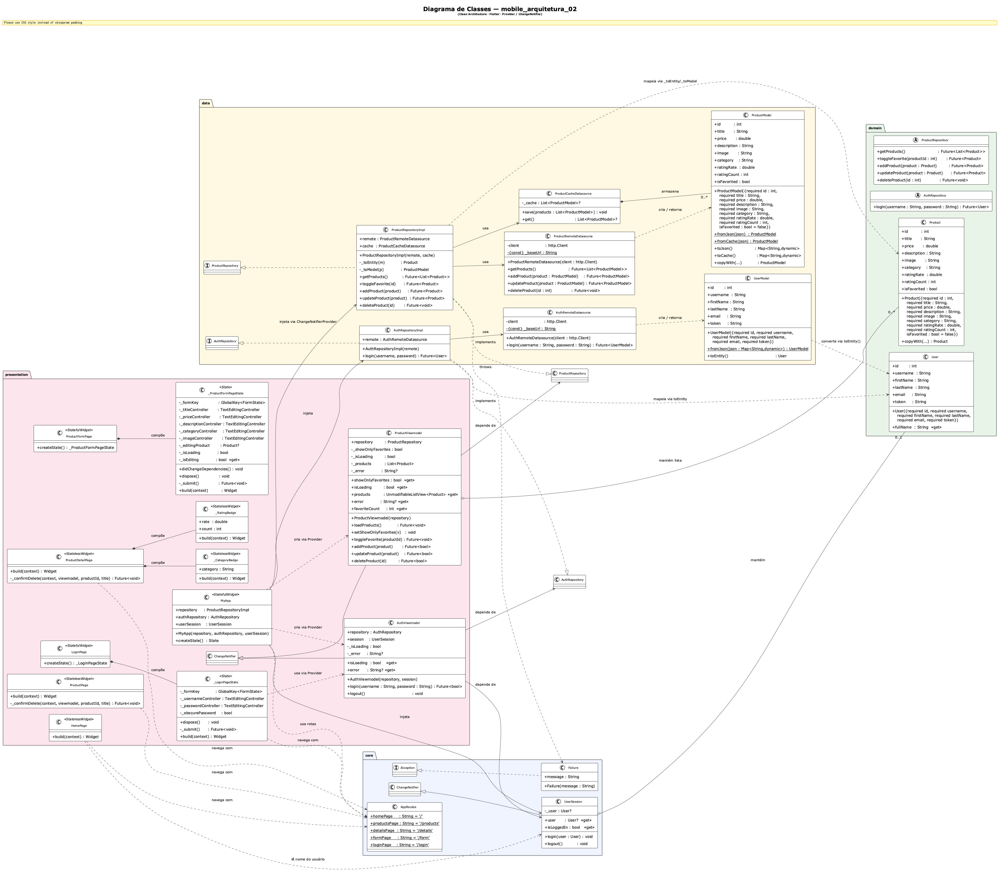

# mobile_arquitetura_02

Aplicação Flutter de catálogo de produtos com autenticação, desenvolvida como projeto de estudo de arquitetura mobile.  
Consome a [DummyJSON API](https://dummyjson.com) para autenticação e listagem de produtos, seguindo os princípios de **Clean Architecture** com gerenciamento de estado via **Provider / ChangeNotifier**.

---

## Funcionalidades

- **Autenticação** — login via DummyJSON com validação de campos e tratamento de credenciais inválidas
- **Proteção de rotas** — todas as telas internas exigem sessão ativa; usuário não autenticado é redirecionado para `/login`
- **Sessão de usuário** — nome completo exibido na tela principal; logout encerra a sessão e retorna para o login
- **Listagem de produtos** — consome `GET /products` da DummyJSON com cache em memória e suporte a filtro de favoritos
- **Detalhe do produto** — exibe imagem, categoria, preço, avaliação e descrição completa
- **CRUD de produtos** — adicionar, editar e excluir produtos com confirmação
- **Favoritos** — marcar/desmarcar favoritos localmente com filtro na listagem

---

## Tecnologias

| Pacote | Versão | Uso |
|---|---|---|
| Flutter | SDK | Framework UI |
| `http` | ^1.6.0 | Requisições HTTP |
| `provider` | ^6.1.5 | Gerenciamento de estado |
| DummyJSON API | — | Back-end de auth e produtos |

---

## Arquitetura

O projeto segue a **Clean Architecture** dividida em três camadas principais:

```
lib/
├── core/
│   ├── app_routes.dart          # Constantes de rotas nomeadas
│   ├── errors/
│   │   └── failure.dart         # Exceção de domínio
│   └── session/
│       └── user_session.dart    # Estado global da sessão (ChangeNotifier)
│
├── domain/                      # Regras de negócio — sem dependência de frameworks
│   ├── entities/
│   │   ├── product.dart
│   │   └── user.dart
│   └── repositories/
│       ├── auth_repository.dart
│       └── product_repository.dart
│
├── data/                        # Acesso a dados — implementações concretas
│   ├── datasources/
│   │   ├── auth_remote_datasource.dart
│   │   ├── product_cache_datasource.dart
│   │   └── product_remote_datasource.dart
│   ├── models/
│   │   ├── product_model.dart
│   │   └── user_model.dart
│   └── repositories/
│       ├── auth_repository_impl.dart
│       └── product_repository_impl.dart
│
└── presentation/                # UI — telas e ViewModels
    ├── pages/
    │   ├── login_page.dart
    │   ├── home_page.dart
    │   ├── product_page.dart
    │   ├── product_detail_page.dart
    │   └── product_form_page.dart
    └── viewmodels/
        ├── auth_viewmodel.dart
        └── product_viewmodel.dart
```

### Fluxo de navegação

```
Inicialização
     │
     ▼
 LoginPage  ──── credenciais inválidas ──▶  SnackBar de erro
     │
     │ login bem-sucedido
     ▼
 HomePage  (exibe nome do usuário + botão logout)
     │
     ▼
 ProductPage  (lista + filtro de favoritos)
     │
     ├──▶ ProductDetailPage  (detalhes + editar/excluir)
     └──▶ ProductFormPage    (novo produto ou edição)
```

Qualquer tentativa de acessar uma rota protegida sem sessão ativa é interceptada pelo guard em `onGenerateRoute` e redirecionada para `LoginPage`.

---

## API — DummyJSON

| Operação | Método | Endpoint |
|---|---|---|
| Login | `POST` | `/auth/login` |
| Listar produtos | `GET` | `/products` |
| Detalhe do produto | `GET` | `/products/{id}` |
| Criar produto | `POST` | `/products/add` |
| Atualizar produto | `PUT` | `/products/{id}` |
| Excluir produto | `DELETE` | `/products/{id}` |

### Credenciais de teste

A DummyJSON disponibiliza usuários de teste. Exemplo:

| Campo | Valor |
|---|---|
| Usuário | `emilys` |
| Senha | `emilyspass` |

> Outros usuários disponíveis em: [https://dummyjson.com/users](https://dummyjson.com/users)

---

## Diagrama de Classes



> Fonte PlantUML: [`docs/uml_classes.puml`](docs/uml_classes.puml)

---

## Como executar

### Pré-requisitos

- [Flutter SDK](https://docs.flutter.dev/get-started/install) ≥ 3.9
- Dart ≥ 3.9
- Dispositivo/emulador Android, iOS ou Web configurado

### Passos

```bash
# 1. Clone o repositório
git clone https://github.com/1Brandao/mobile_arquitetura_02.git
cd mobile_arquitetura_02

# 2. Instale as dependências
flutter pub get

# 3. Execute a aplicação
flutter run
```

### Verificar qualidade do código

```bash
flutter analyze
```

---

## Estrutura de injeção de dependências

As dependências são criadas e injetadas em `MyApp` (StatefulWidget) sem nenhum framework externo de DI:

```
MyApp (StatefulWidget)
├── http.Client          ← criado em initState(), descartado em dispose()
├── UserSession          ← ChangeNotifier compartilhado entre AuthViewmodel e telas
├── AuthRepositoryImpl   ← typed as AuthRepository (interface)
└── ProductRepositoryImpl ← typed as ProductRepository (interface)
```

Todos os providers são registrados via `MultiProvider` e disponibilizados para a árvore de widgets.
